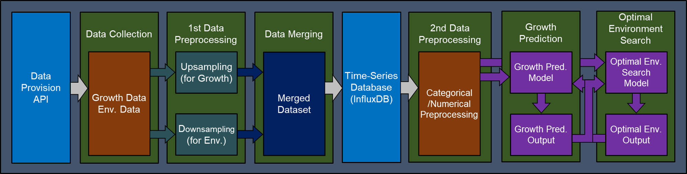

# Optimal Environment Search System for Maximizing Crop Growth in Smart Greenhouses

This is the official repository for the paper: **"Optimal Environment Search System for Maximizing Crop Growth in Smart Greenhouses"**.

This project provides a framework to find the optimal environmental conditions (Temperature, Humidity, $CO_2$, etc.) to maximize the growth of tomato plants in smart greenhouse environments using a data-driven search system.

---

# Dataset Description
The experimental evaluation was conducted using a dataset collected from real-world smart greenhouses.

- Source: Two smart greenhouse units installed by the National Institute of Agricultural Sciences in Korea.

- Duration: 238 days.

- Samples: 48 tomato plants (24 samples per greenhouse).

- Data Characteristics:

  - Growth Data: Weekly manual observations (low frequency).

  - Environmental Data: 1-minute interval sensor data (high frequency).

- Preprocessing (Section 2.3): To address the data imbalance, we synchronized the time scales:

  - Growth Data: Upsampled to a daily interval.

  - Environmental Data: Downsampled to a daily interval.

  - The resulting daily-aligned dataset was used for training and search evaluation.

# Code Explanation
The core logic of the system is integrated into a single execution environment for transparency and reproducibility:

- main.ipynb: This is the primary file containing all configurations. It covers the full pipeline:

  - Data loading and 1st-data preprocessing (Upsampling/Downsampling).

  - Model training for growth prediction.

  - Implementation of the Optimal Environment Search algorithm.

  - Experimental results and performance evaluation.